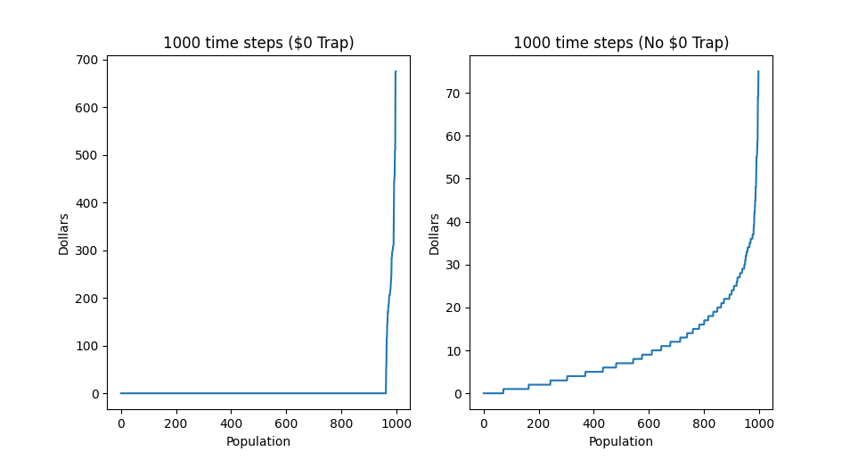

### Trade Sim

Welcome to the Simple Trading Simulator, a C++ project utilizing the STL random library to model a population of traders. Each trader begins with the same amount of money and trades randomly with one another over a specified number of time steps.

Here’s the process: at each time step, every pair of traders flips a coin to decide the outcome of their trade. If the coin lands on heads, trader 1 gives trader 2 $1. If it's tails, trader 2 gives trader 1 $1.

The simulator offers two types of simulations:

- No Money, No Trading: Traders with $0 are excluded from further trading.
- Half-Chance Comeback: Traders with $0 can still receive money 50% of the time, but cannot give money.

In the first scenario, wealth tends to concentrate in a small minority of traders over time. This occurs because traders who reach $0 are permanently excluded from trading, while those with positive balances continue to trade and potentially accumulate more wealth. For instance, starting with $10, a trader is equally likely to reach $0 as they are to reach $20 after a certain number of trades. However, only those who avoid $0 continue to participate, increasing wealth concentration as the number of trades grows.

In the second scenario, allowing traders with $0 to receive money keeps the distribution of wealth more consistent across the population.

Explore the dynamics of randomness and wealth distribution with this trading simulator!

## Usage

This repo uses a simple CMake setup. With cmake installed and in $PATH, enter the `build/debug` or `build/release` directory and use the following commands:

```
cmake -DCMAKE_BUILD_TYPE=Debug ../..
make
./trade-sim
```

or

```
cmake -DCMAKE_BUILD_TYPE=Release ../..
make
./trade-sim
```

Debug mode will include logging but isn't optimised and will run significantly slower.

[Nlohmann-json](https://github.com/nlohmann/json) was also used for serialization. See their Readme for installation instructions.

## Results



The plots found in `./plots` show a comparison between the two methods for a given population size and number of time steps. The graph shows the distribution of wealth amongst traders at the final time step.


## Sample Output

```
-- Starting simulation where traders can't trade anymore once they hit zero --
Finished simulation
For 100 people and 100 duration, only 17% are left with non-zero money at the end.
-- Starting simulation where traders can't trade anymore once they hit zero --
Finished simulation
For 100 people and 1000 duration, only 7% are left with non-zero money at the end.
-- Starting simulation where traders can't trade anymore once they hit zero --
Finished simulation
For 1000 people and 100 duration, only 7.6% are left with non-zero money at the end.
-- Starting simulation where traders can't trade anymore once they hit zero --
Finished simulation
For 1000 people and 1000 duration, only 3.6% are left with non-zero money at the end.
-----------
-- Starting simulation where traders can only receive money once they hit zero --
Finished simulation
For 100 people and 100 duration, only 92% are left with non-zero money at the end.
-- Starting simulation where traders can only receive money once they hit zero --
Finished simulation
For 100 people and 1000 duration, only 90% are left with non-zero money at the end.
-- Starting simulation where traders can only receive money once they hit zero --
Finished simulation
For 1000 people and 100 duration, only 91.3% are left with non-zero money at the end.
-- Starting simulation where traders can only receive money once they hit zero --
Finished simulation
For 1000 people and 1000 duration, only 92.8% are left with non-zero money at the end.
-----------
Program took 5100 ms
```